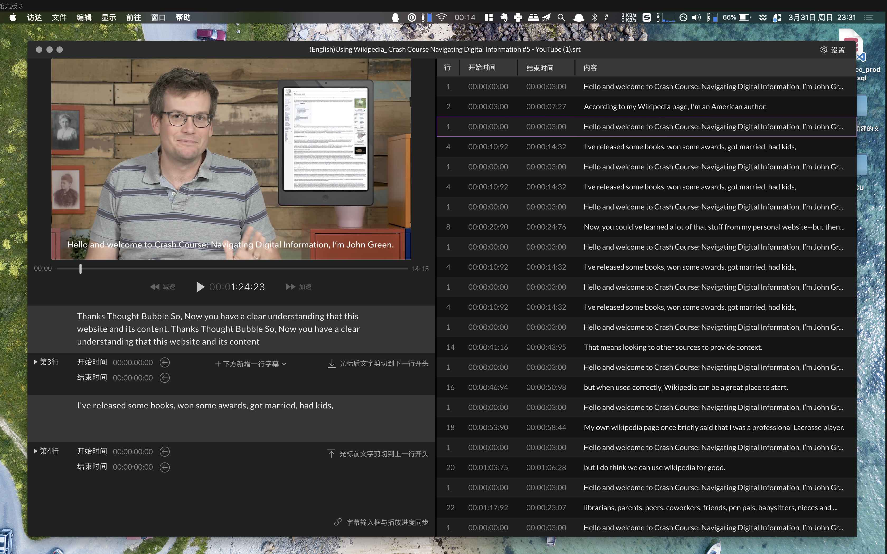

## 时间轴小助手
说明：这是个做到一半放弃掉的 Electron.js 项目。       

### 软件截图(做到一半)
     

视频演示 (40秒整, 1080p)     
https://www.youtube.com/watch?v=tf06au731Ls

### 设计图(目标)


### 说明 (解决什么问题)
一个字幕时间轴编辑工具。[详情说明请看博客](https://1c7.me/timeline-tools/)         
重点：简单，好看，有夜间模式，快捷键操作方便。       

### 目标用户群
字幕组

### 废弃原因：
视频 `<video>` tag 做不到 frame by frame 以及毫秒级控制。是 Web Standard 还不够造成的。

### 项目时间
* 项目开始时间: 2019年4月6号
* 项目废弃时间: 2019年4月7号

### 本地运行
```
git clone https://github.com/1c7/timeline.git
cd timeline
npm install
npm run start
```

### 技术
* Electron.js (5.0.0-beta.8)
* Vue.js (2.6.10)

### 开源的目的
反正对我也没用了，开源出来如果对谁有那么一点点参考价值。也算有用。