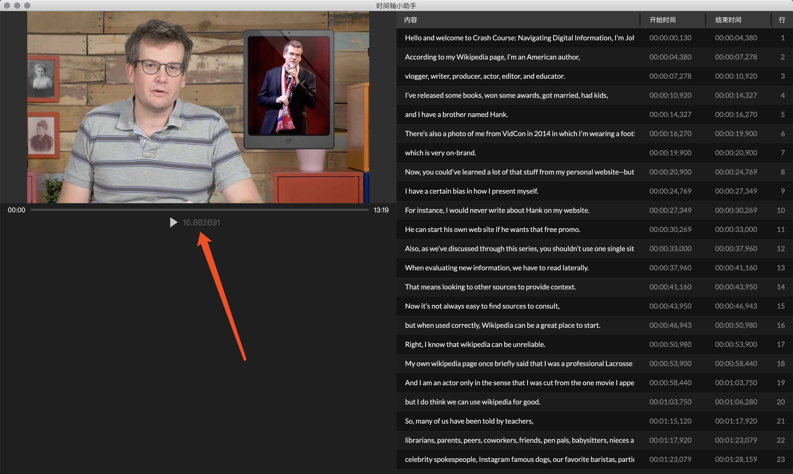

## 时间轴小助手
说明：这是一个做到一半放弃掉的 Electron.js 项目。这是搞时间轴编辑器。
废弃原因：视频做不到 frame by frame 以及毫秒级控制。是 Web Standard 还不够造成的。

### 截图


开始时间: 2019年4月6号
废弃时间: 2019年4月7号

### 本地运行
```
npm install
npm run start
```

### Tech Stack
* Electron.js (5.0.0-beta.8)
* Vue.js (2.6.10)
